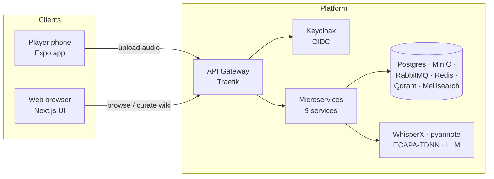
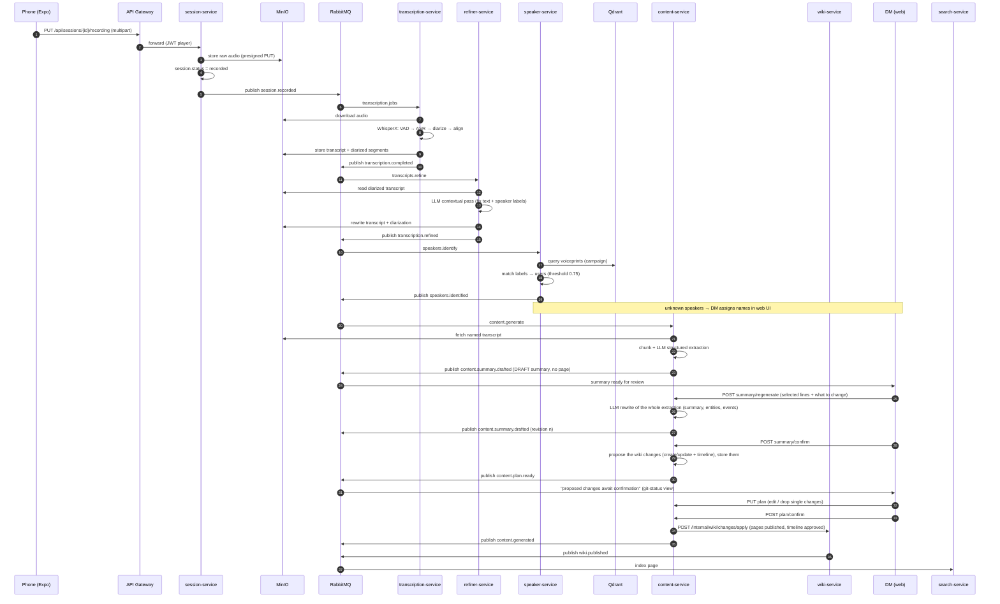

# DnD Wiki — System Architecture

> A platform that turns tabletop D&D sessions into a living campaign wiki.
> Players record the session with a phone at the center of the table; the platform
> transcribes the audio (WhisperX), identifies who spoke (voiceprints), and LLMs
> distill the named transcript into wiki pages (characters, locations, factions,
> items, quests) plus a per-session summary; events will surface on the
> timeline view. The Dungeon Master curates; players read.

---

## 1. Goals & non-goals

**Goals**

1. **Record once, wiki forever** — one phone recording per session produces a
   named, searchable transcript plus a structured wiki draft.
2. **Zero-effort speaker attribution** — diarized segments are matched to enrolled
   player voiceprints automatically; the DM only names strangers the first time.
3. **DM-owned content** — everything the LLM generates is proposed to the DM
   first (the session summary, then the change set) and written into the wiki
   only once confirmed; the DM alone can publish, edit, or hide pages. No
   pipeline-generated page ever sits in a "pending review" state.
4. **Strict read-only players** — player accounts can view published pages only.
5. **Horizontal scalability where it matters** — the GPU transcription and the LLM
   generation are queue-driven workers that scale independently.

**Non-goals (v1)**

- Live transcription during the session (batch processing after upload).
- Real-time multi-player audio (single phone, single track).
- Video processing.
- Public/anonymous wiki sharing.

---

## 2. System context



---

## 3. Service catalog

| # | Service | Tech | Responsibility | Owns data |
|---|---------|------|----------------|-----------|
| 1 | `user-service` | Python/FastAPI | User profiles, speaker identities, voiceprint enrollment (upload + embed a 10–30 s sample) | `dnd_users` (PG), `voiceprints` (Qdrant) |
| 2 | `campaign-service` | Python/FastAPI | Campaigns, membership, roles (`dm`/`player`), invites, campaign settings | `dnd_campaigns` (PG) |
| 3 | `session-service` | Python/FastAPI | Recording upload (multipart → MinIO), session state machine, session list | `dnd_sessions` (PG), `recordings` bucket |
| 4 | `transcription-service` | Python + WhisperX (GPU) — or Python + cloud API backend (`docker-compose.transcription.yml`): Deepgram Nova 3 (default) / OpenAI `gpt-4o-transcribe-diarize`, selected by `TRANSCRIPTION_PROVIDER` | Consumes `transcription.jobs`; ASR + diarization (locally via WhisperX, or in the cloud via Deepgram/OpenAI); persists transcript | `transcripts` bucket (job status in `dnd_sessions`) |
| 5 | `speaker-service` | Python + SpeechBrain | Consumes `speakers.identify`; re-clusters raw diarizer labels from its own ECAPA-TDNN embeddings (overrides unreliable per-chunk labels), then matches each cluster against campaign voiceprints in Qdrant; auto-assigns or flags for DM | `speaker_assignments` (in `dnd_sessions`), `voiceprints` (Qdrant) |
| 5 | `speaker-service` | Python + SpeechBrain | Consumes `speakers.identify`; re-clusters raw diarizer labels from its own ECAPA-TDNN embeddings (overrides unreliable per-chunk labels), then matches each cluster against campaign voiceprints in Qdrant; auto-assigns or flags for DM | `speaker_assignments` (in `dnd_sessions`), `voiceprints` (Qdrant) |
| 5b | `refiner-service` | Python + LiteLLM | Consumes `transcription.completed`; LLM contextual diarization — fixes transcription errors and speaker attribution (turn-level, preserving timings) using the campaign cast (character names + physical descriptions from campaign-service), rewrites transcript/diarization.json, emits `transcription.refined` | `transcripts` bucket (rewrites in place) |
| 6 | `content-service` | Python + LiteLLM | Consumes `content.generate`; chunks the named transcript and LLM-extracts it into a **draft session summary** the DM reviews (rewrite-with-feedback loop), then — only once the DM confirms it — creates the wiki drafts and events via wiki-service | `generation_jobs`, `session_summaries` (in `dnd_content`) |
| 7 | `wiki-service` | Python/FastAPI | Wiki CRUD, page versions, cross-references, visibility rules (`public`/`dm_only`/`hidden`), DM approval, timelines | `dnd_wiki` (PG), `wiki-assets` bucket |
| 8 | `search-service` | Python + Meilisearch | Listens to wiki events, indexes published pages, serves search | Meilisearch index `wiki_pages` |
| 9 | `notification-service` | Python/FastAPI | Listens to domain events, delivers emails/webhooks/push (DM: "draft ready"; players: "new session") | `notifications` (in `dnd_content`) |

**Frontends**

- `apps/web` — Next.js 14. Two experiences in one app: **DM console** (approve drafts,
  edit, hide pages, assign speakers) and **player library** (browse/search/read).
- `apps/mobile` — Expo (React Native). The only job: record the session, show upload
  progress, and let players pre-name new voices ("that's Bob's friend") that the DM
  later confirms.

---

## 4. Technology decisions

| Concern | Choice | Why |
|---|---|---|
| Business service runtime | Python 3.12 + FastAPI | Same language across the whole backend; WhisperX/SpeechBrain/LLM tooling is Python-native; async-first fits I/O-heavy workers |
| ORM / migrations | SQLAlchemy 2 (async) + Alembic | Mature async stack; per-service migration directories |
| Identity | Keycloak 24 (OIDC) | Realm roles `dm`/`player` map 1:1 to our permission model; handles signup/login/refresh; we never store passwords |
| Primary DB | PostgreSQL 16, **database-per-service** | Relational core (memberships, sessions, wiki, versions); JSONB for flexible page bodies; separate DBs keep service boundaries honest |
| Vector DB | Qdrant | Voiceprint similarity search (cosine) + future semantic search over wiki content; lightweight, docker-friendly |
| Object storage | MinIO (S3 API) | Raw audio, transcripts, generated assets; presigned URLs for phone upload/download |
| Message broker | RabbitMQ (topic exchange `dnd.events`) | Job queues (transcription/speaker/content) + domain events (notifications, search index). Kafka is overkill for this volume |
| Cache | Redis | Session status cache, rate limiting, Keycloak JWKS cache |
| Search | Meilisearch | Typo-tolerant full-text search over wiki pages; trivial to operate; good dev experience |
| API gateway | Traefik v3 edge router + per-service JWT validation | Lightweight; JWT enforcement stays in each service via the shared lib (no gateway SPOF for authz) |
| ASR + diarization | [WhisperX](https://github.com/m-bain/whisperX) (faster-whisper `small` by default, pyannote 3.1) — API variants: Deepgram Nova 3 (`diarize=true`, default) or OpenAI `gpt-4o-transcribe-diarize` (`diarized_json`), selected by `TRANSCRIPTION_PROVIDER` in `docker-compose.transcription.yml` | Word-level alignment out of the box; `small` is the CPU-friendly default, `large-v3` for GPU. Faster-whisper/CTranslate2 backend with `int8` on CPU. The API variants (`services/transcription-deepgram-service`, `services/transcription-openai-service`) remove all local models and run ASR + speaker diarization in a single cloud request; speaker identification still runs locally on ECAPA-TDNN voiceprints, preserving the naming system |
| Speaker embeddings | SpeechBrain `spkrec-ecapa-voxceleb` | 192-d embeddings; cosine agglomerative re-clustering overrides raw diarizer labels, then cosine matching to enrolled voiceprints; runs on CPU fine |
| LLM access | LiteLLM | One abstraction over OpenAI/Anthropic/Ollama/vLLM — swap providers per environment; structured-output via JSON schema |
| Orchestration | Docker Compose (dev) → Kubernetes (prod) | Compose for the whole stack incl. infra; K8s manifests reserved for prod |
| Observability | Prometheus + Grafana + Loki + Tempo (compose profile) | Metrics, logs, traces; every service exposes `/metrics` and emits OTel traces |

---

## 5. End-to-end flow



### 5.1 Session state machine

```
uploaded → recorded → transcribing → transcribed → refining → refined
        → identifying_speakers → speakers_identified
        → (speaker_pending: DM names + confirms the speakers) → summarizing → summary_ready
        → generating_wiki → wiki_plan_ready → applying_wiki → content_ready
        → reviewed → published

`refining`/`refined` is the LLM contextual-diarization stage (refiner-service,
optional via `REFINER_ENABLED`); when disabled, `transcribed` jumps straight to
`identifying_speakers` as before.

`summarizing`/`summary_ready` is the **session-summary review layer**
(content-service). The transcript is distilled into a DRAFT summary the DM
reviews on the session page; `summary_ready` parks the session there until the
DM either sends it back with feedback (`summary_ready → summarizing`) or
confirms it (`summary_ready → generating_wiki`).

`generating_wiki`/`wiki_plan_ready`/`applying_wiki` is the **change-set review
layer**. The confirmed summary is turned into a set of PROPOSED changes (pages
to create, pages to update and the timeline entries they back, each carrying the
page it targets and that page's current content for a per-field diff); nothing
is written yet. `wiki_plan_ready` waits for the DM to inspect, edit or drop
single changes and confirm the set, and only `applying_wiki` writes it —
creating the pages PUBLISHED and the timeline entries APPROVED, so no
pipeline-generated page ever sits in "pending review".
```

Stored on `sessions.status` (session-service DB). Each worker transitions the state
and publishes the matching event; failures set `status=failed` + `error` and are
retried with exponential backoff (max 3 attempts).

---

## 6. Voiceprint enrollment & identification

> **Superseded — implemented behind `ATTRIBUTION_ENABLED`.** The label-to-member
> model and the `speaker_pending` gate described below are replaced by the
> evidence-first attribution redesign — see
> `docs/adr/0002-evidence-first-speaker-attribution.md`,
> `docs/attribution-model.md`, `docs/attribution-ux.md` and
> `docs/attribution-plan.md`.
>
> With the flag **off** (the default) the behaviour documented in this section is
> exactly what runs, byte for byte. With it **on**, `services/attribution-service`
> owns speaker attribution: it consumes the per-observation voice evidence that
> `speaker-service` now publishes alongside its legacy verdicts, keeps a
> posterior per utterance in `dnd_attribution`, and replaces the blocking
> `speaker_pending` stage with a skippable `attribution_review`. The services
> below keep their roles otherwise; what changes is who decides.

**Enrollment (first time, DM-driven)**

1. DM opens the campaign → *Players* → *Add voiceprint* for a member.
2. The member records 10–30 s of speech in the phone app (or uploads an audio clip).
3. `user-service` stores the clip in MinIO and extracts an ECAPA-TDNN embedding.
4. The embedding is upserted into Qdrant collection `voiceprints` with payload
   `{user_id, campaign_id, sample_uri, version}`.

**Identification (per session)**

1. `refiner-service` (when `REFINER_ENABLED`) consumes the diarized transcript and
   runs an LLM contextual pass: it fixes transcription errors and speaker
   attribution turn by turn (labels are untrusted — they may be swapped and reset
   per chunk), rewriting transcript/diarization.json with consistent canonical
   `SPEAKER_XX` labels while preserving every segment's timings.
2. `speaker-service` receives the refined segments (`transcription.refined`). When
   the refiner is disabled it receives the raw `transcription.completed` instead
   and first re-clusters the raw labels from its own ECAPA-TDNN embeddings
   (cosine agglomerative, seeded by per-campaign enrollment centroids).
   Before matching, it also learns the campaign's **speaker history**: the DM's
   manual namings in earlier sessions (session-service
   `GET /internal/campaigns/{id}/speaker-history`) become voice samples — the
   labelled turns of at least `HISTORY_SAMPLE_MIN_SEC`, of at least
   `HISTORY_SAMPLE_MIN_CONFIDENCE` diarization confidence, capped per label and
   per run, enrolled once (`source: "history"`).
3. Each label is matched to the campaign voiceprints in Qdrant (anchor centroids
   shortcut known speakers); best match ≥ `SPEAKER_MATCH_THRESHOLD` (0.75) → auto-assign.
4. Below threshold → `speaker_assignments.status = pending`; DM is notified and
   assigns a name (which also enrolls a new voiceprint if the speaker is new).
   A match above the threshold lands `auto` and the DM either **confirms** it in
   the speaker panel (one click, roster member + character name filled in) or
   picks another member; confirming is what turns the proposal into a voice
   sample for the sessions that come after it.
   The session stays on `speaker_pending` until **every** label is `confirmed`
   (named or accepted): an `auto` match is a proposal, not a decision, so the
   summary never starts from speakers nobody validated.

> Voiceprints are **per campaign** — the same person can be "Gandalf" in one
> campaign and "Dumbledore" in another. Embeddings never leave the platform.

---

## 7. LLM content generation

1. The named transcript (with timestamps + speaker names) is split into overlapping
   chunks (~4k tokens, 10% overlap).
2. Each chunk goes to the LLM with a strict JSON schema (characters, locations,
   events, timeline entries, session summary) via LiteLLM; the wiki drafts are
   characters and locations only — events/session recaps live on the session
   page (events later move to the timeline view).
3. Extractions are merged across chunks: entities are deduplicated by name +
   similarity (embedding distance), conflicts resolved by majority or kept as
   separate mentions.
4. The DM reviews the proposed **change set** (the "git status" of the
   session) and confirms it; the worker then writes the pages through
   `wiki-service`'s internal apply endpoint as `status=published` (the
   confirmation IS the approval) with a confidence score, plus the proposed
   cross-links (`page_relations`) and timeline entries (`approved=true`).
5. The DM can still edit, archive or hide any page afterwards
   (`visibility=dm_only`/`hidden` — players never see those).

**Prompt versioning**: `generation_jobs.prompt_version` pins the prompt template;
bumping it invalidates old drafts so regenerations are reproducible.

---

## 8. Permissions model

| Capability | Player | DM |
|---|---|---|
| View published wiki pages | ✅ | ✅ |
| Search the wiki | ✅ | ✅ |
| Browse sessions + transcripts | ✅ (own campaign) | ✅ |
| Record/upload session audio | ✅ (own campaign) | ✅ |
| Add voiceprint for self | ✅ | ✅ |
| Assign/confirm speakers | ❌ | ✅ |
| Review/approve/edit wiki drafts | ❌ | ✅ |
| Create/edit/delete wiki pages | ❌ | ✅ |
| Hide pages / `dm_only` visibility | ❌ | ✅ |
| Manage campaign membership | ❌ | ✅ |

**Enforcement:** Keycloak realm roles `dm` and `player` are mapped to claims; the
shared auth layer (`dnd_common.auth`) validates the JWT **and** the campaign
membership + role (checked against campaign-service via an internal token or a
cached membership table). Every wiki query is scoped by `campaign_id` — a player
can never address another campaign's page id.

---

## 9. Data ownership (database-per-service)

| Database | Owned by | Key tables |
|---|---|---|
| `dnd_users` | user-service | users, voice_profiles |
| `dnd_campaigns` | campaign-service | campaigns, campaign_members |
| `dnd_sessions` | session-service | sessions, session_recordings, speaker_assignments |
| `dnd_wiki` | wiki-service | wiki_pages, page_versions, page_relations, timeline_events |
| `dnd_content` | content-service | generation_jobs, notifications |

Services never read another service's tables — they call its HTTP API or react to
events. Qdrant `voiceprints` belongs to user-service; Meilisearch belongs to
search-service.

---

## 10. Deployment

**Dev (this repo):** one `docker compose` file runs the entire stack — infra,
services, web — with hot-ish rebuilds. GPU transcription via the `.gpu.yml`
override.

**Prod (future):** Kubernetes. Key notes captured for later:

- `transcription-service` as a `Deployment` with GPU node selector + `Job`-style
  autoscaling on queue depth.
- Managed PostgreSQL (Aurora/Cloud SQL), managed S3 instead of MinIO (the app
  already speaks the S3 API via presigned URLs).
- Keycloak in HA mode; realm exported via Terraform/Helm.
- Queues get DLQs + dead-letter queues; alerts on `sessions.status=failed`.

---

## 11. Observability & security

- **Metrics:** every service exposes Prometheus `/metrics`; RabbitMQ/Postgres/Redis
  exporters scrape in the monitoring profile.
- **Logs:** structured JSON → Loki (via promtail/docker logging driver in prod).
- **Traces:** OTel instrumentation → Tempo; worker pipelines tag spans with
  `session_id` for end-to-end correlation.
- **Secrets:** only in `.env` / K8s secrets — never in images. `HF_TOKEN` is
  required for gated pyannote models.
- **Media access:** audio/transcripts are served through short-lived presigned
  MinIO URLs; never public buckets.
- **LLM data:** transcripts contain sensitive conversation; LLM provider is a
  config point — self-hosted (Ollama/vLLM) is a first-class option.

---

## 12. Roadmap (post-scaffold)

1. Shared lib + first two services end-to-end (auth, campaign).
2. Session upload → WhisperX pipeline → transcript in UI (smoke test on real audio).
3. Voiceprint enrollment + auto-identification.
4. LLM draft generation + DM approval loop.
5. Search, notifications, mobile polish, K8s manifests.